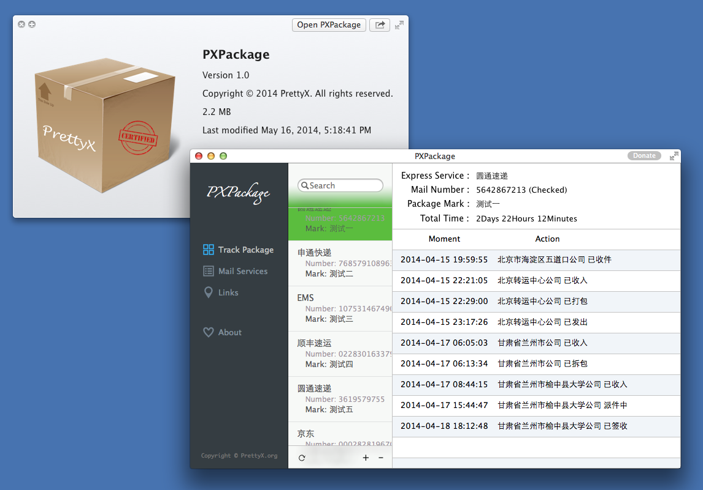
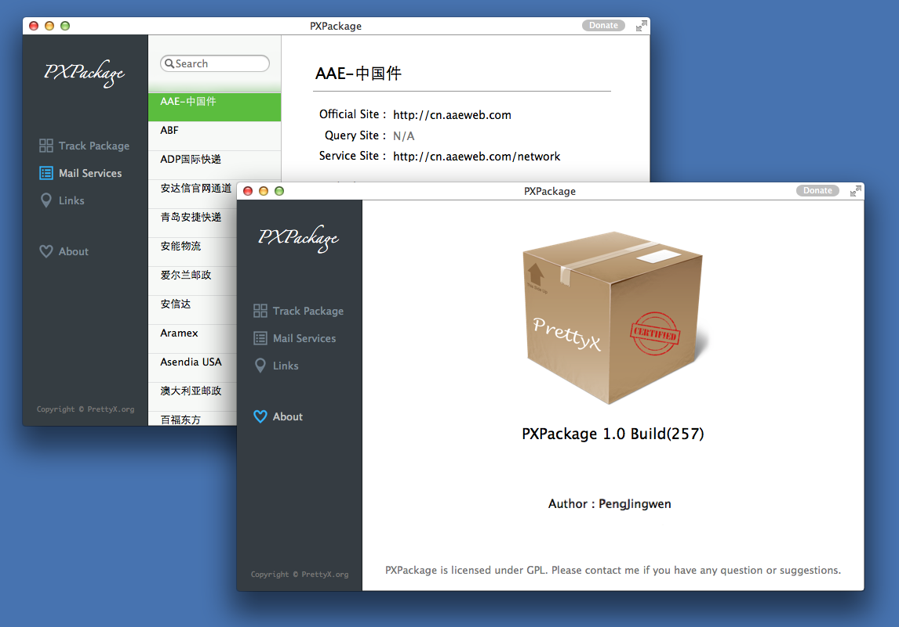

PXPackage
=========
A Mac OS X Cocoa Application to Track Mail Express Services.

Version 1.0
-----------

* Support 300+ mail express service companies.  
* Support mail express service information lookup.  
* Support keeping multi-package state.  
* Support adding custom mark to package.  
* Support auto refresh data in the background. (The number of new track information will appear at upper right conner of the app icon in the dock, and the icon in the dock will bounce.)
* Support Chinese & English user interface.  

LICENSE
-------
The GPL License. Read [GNU General Public License](http://www.gnu.org/licenses/gpl.html) for further information.